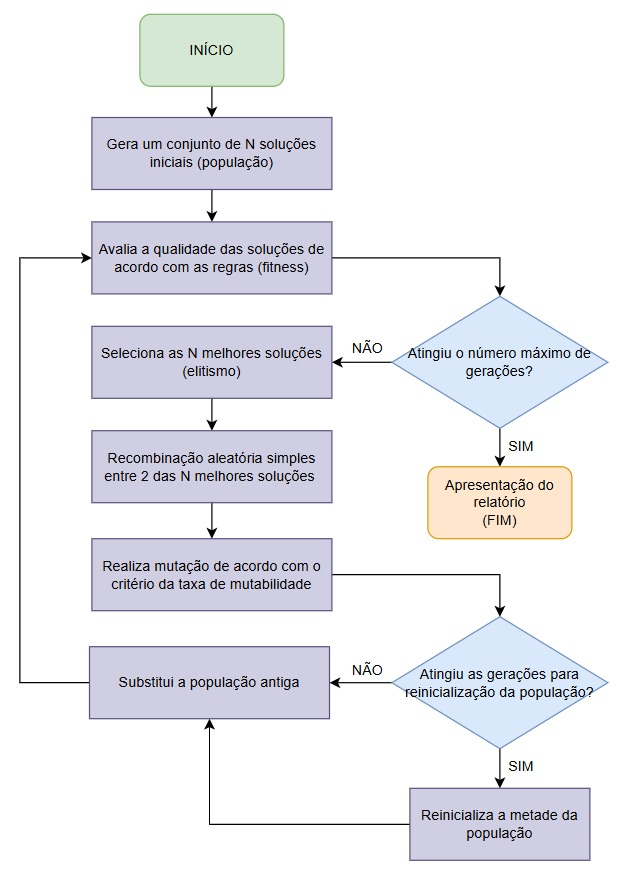
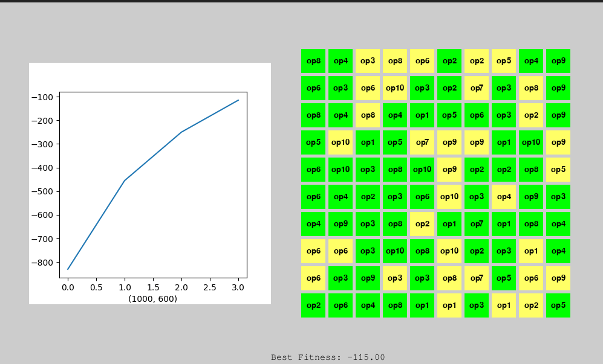
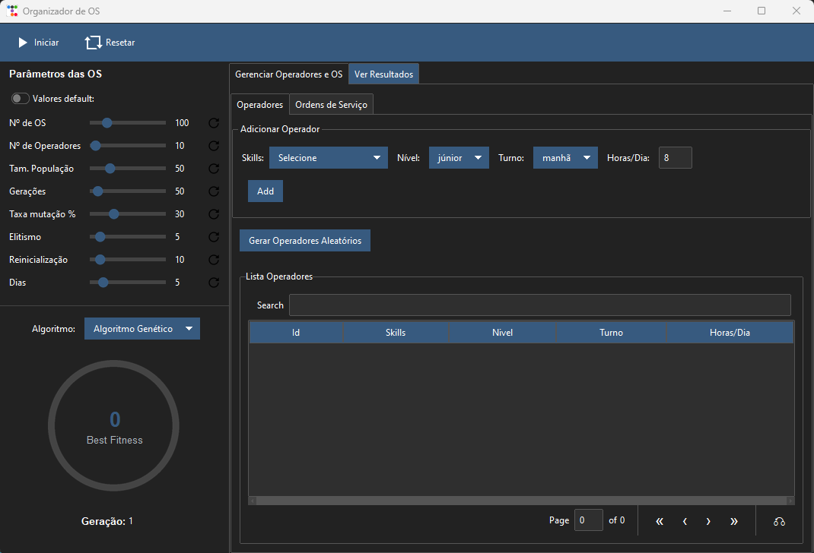
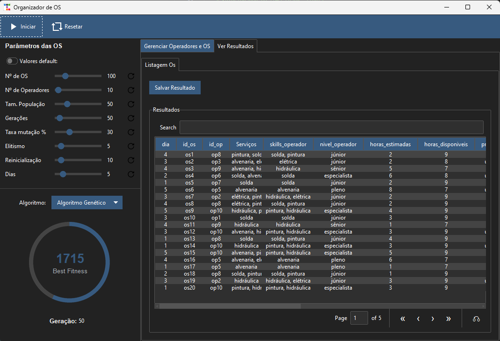

# Tech Challenge - Pós-Tech SOAT - FIAP
# Fase 2

Alunos:

* André Mattos - RM358905
* Aurelio Thomasi Jr - RM358104
* Leonardo Ramires - RM358190
* Lucas Arruda - RM358628
* Pedro Marins - RM356883

## Interface TKInter 

* Aurelio Thomasi Jr - RM358104

## Evidências do projeto
- [Link para o vídeo do projeto](https://youtu.be/LQtUcsGbxds)

## Como rodar o projeto

1. Clonar o repositório
   ```bash
   git clone https://github.com/Hideroshi/FIAP.git
   ```
2. Instalar as dependências
   ```bash
   pip install -r Fase2/requirements.txt
   ```
3. Rodar o projeto
   ```bash
   python Fase2/main_tkinter.py
   ```

> **Sobre instalação das dependências**: É recomendável utilizar o ambiente virtual do Python para instalar as dependências, utilizando o comando `python -m venv .venv` e depois ativar o ambiente virtual com o comando `source .venv/bin/activate`.

## Definição do Problema
O problema consiste em alocar ordens de serviço (OS) de manutenção para operadores de forma otimizada, considerando as habilidades necessárias para cada ordem e as habilidades dos operadores disponíveis. 
O problema a ser resolvido é maximizar a produtividade operacional, assegurando o cumprimento dos prazos estabelecidos, evitar horas extras desnecessárias e garantir que as ordens sejam atendidas dentro do prazo estipulado.

## Objetivos
O projeto aborda o desafio crítico de otimização na alocação de ordens de serviço (OS) de manutenção. Através de um algoritmo especializado, o sistema realiza o pareamento preciso entre as competências técnicas dos operadores e as exigências específicas de cada ordem.

Alocar ordens de serviço de forma eficiente, maximizando a compatibilidade entre as habilidades dos operadores e as habilidades necessárias para as ordens.
Minimizar o número de horas extras trabalhadas pelos operadores.
Garantir que as ordens de maior prioridade sejam atendidas dentro do prazo.

## O Projeto


*Figura 1: Fluxograma do Algoritmo Genético*

Este projeto foi desenvolvido utilizando um algoritmo genético para otimizar a alocação de ordens de serviço aos operadores. As seguintes informações relevantes sobre as ordens e operadores são utilizadas para a otimização:

- **Dados das ordens**: Incluem o tempo estimado de execução, habilidades necessárias, prioridade, status, e o dia esperado de início do atendimento.
- **Dados dos operadores**: Contêm as habilidades disponíveis, nível de qualificação e horas disponíveis.

Abaixo estão os pontos essenciais desta solução, com os principais detalhes:

### 1. Reajuste nas Funções de Aptidão
- ✨ Adição de pesos considerando a prioridade da OS
- 📊 Penalização proporcional por horas extras

### 2. Otimização do Crossover
- 🔄 Crossover em dois segmentos com ponto de corte aleatório
- 📊 Validação de compatibilidade de habilidades (mínimo 50%)
- 🔒 Garantia de atribuição única para cada ordem
- 🎯 Realocação aleatória de ordens não atribuídas

### 3. Processo de Mutação Inteligente
- 🧬 Taxa de mutação adaptativa (reduz ao longo das gerações)
- 🎯 Validação de compatibilidade de habilidades do operador
- 🔄 Verificação da qualidade pós-mutação
- ↩️ Reversão automática de mutações prejudiciais

### 4. Sistema de Elitismo
- 🏆 Preservação dos N melhores indivíduos (5 melhores por default)
- 📈 Manutenção de soluções de alta qualidade entre gerações

> **Sobre o elitismo**: Os 5 melhores indivíduos são preservados entre as gerações. Se o elitismo for alterada para 7, os 7 melhores indivíduos seriam preservados.

### 5. Gestão Populacional
- 🔄 Reinicialização parcial periódica (metade da população)
- 🎯 Prevenção de convergência prematura para uma solução subótima

### 6. Controle de Qualificação
- ✅ Exigência mínima de 50% das habilidades necessárias
- 🚫 Prevenção de alocações inadequadas

## Detalhamento do Algoritmo Genético

### 1. Geração da População Inicial 🌱
A população inicial consiste em um conjunto de soluções (indivíduos) geradas aleatoriamente, onde cada solução representa uma possível alocação de ordens de serviço ao longo do período de 5 dias.
Também existe uma opção de gerar a população inicial com base em uma solução pré-definida.

#### Processo de Geração:
- **Inicialização**: Estrutura base `{"orders": {order_id: {"day": None, "operator": None, "status": "não atendida"}}, "fitness": 0}`
- **Validação de Habilidades**: Filtra operadores válidos com habilidades mínimas necessárias
- **Distribuição Aleatória**: Para cada ordem:
  - Atribui dia aleatório (1 a N dias)
  - Seleciona operador compatível aleatoriamente
  - Define status baseado no prazo esperado (stats possíveis: "não atendida", "atendida", "atrasada")

### 2. Processo de Seleção 🎯
Utilizamos um processo de seleção adaptativo para selecionar os pais para a próxima geração.
Esse processo é feito através dos seguintes passos:

### 3. Processo de Crossover 🔄
O Crossover é feito através de dois segmentos, com as seguintes características:

#### Metodologia do Crossover:
1. **Inicialização**:
   - Cria filho vazio: `{"orders": {}, "fitness": 0}`
   - Garante unicidade das ordens a serem distribuidas (Utilização da estrutura de dados set para garantir a unicidade)

2. **Seleção do Ponto**:
   - Escolha aleatória do ponto de divisão na lista de ordens
   - `crossover_point = random.randint(1, len(orders_parent1) - 1)`

3. **Primeiro Segmento**:
   - Copia ordens do pai 1 até o ponto de crossover
   - Adiciona apenas se ordem não foi atribuída anteriormente

4. **Segundo Segmento**:
   - Copia ordens do pai 2 após o ponto de crossover
   - Evita duplicação de ordens

5. **Tratamento de Ordens Não Atribuídas**:
   - Identifica ordens que não foram atribuídas
   - Atribui aleatoriamente a operadores compatíveis
   - Define dia e status baseado no prazo esperado (stats possíveis: "não atendida", "atendida", "atrasada")

### 4. Processo de Mutação 🧬
A mutação introduz variações nas soluções que são feitas para manter a diversidade genética e evitar a convergência prematura para uma solução subótima. Como foi descrito no fluxograma, a mutação é feita através dos seguintes passos:

#### Procedimento:
1. **Taxa de Mutação Adaptativa**:
   - Cada solução tem chance de `_MUTATION_RATE` de sofrer mutação
   - Alterações podem incluir novo dia ou operador para ordens selecionadas

2. **Reinicialização Periódica**:
   - A cada 10 gerações (valor default)
   - Novas soluções são geradas aleatoriamente para metade da população com o menor fitness.
   - Fitness é recalculado para novos indivíduos

3. **Validações**:
   - Verifica compatibilidade de habilidades do novo operador
   - Atualiza status (atendida/atrasada) baseado no novo dia
   - Recalcula o fitness após mutação

4. **Preservação de Elite**:
- Os 5 melhores indivíduos são preservados (5 é um valor default)
- Garante que boas soluções não sejam perdidas

5. **Controle de Qualidade**:
   - Compara fitness antes e depois da mutação
   - Reverte mudanças se o fitness piorar, para evitar a convergência prematura para uma solução subótima

### 5. Função de Aptidão ⚖️
A função Fitness avalia a qualidade das soluções considerando múltiplos critérios.
Os critérios de avaliação são os seguintes:

#### Critérios de Avaliação:
1. **Compatibilidade de Habilidades**:
   - Verificação se operador possui as habilidades necessárias para a ordem
   - Pontuação positiva para matches completos
   - Penalidades para incompatibilidades

2. **Gestão de Prazos e Status**:
   - Verificação do início esperado vs. dia alocado
   - Status atualizado como "atendida" ou "atrasada" baseado no prazo
   - Priorização de ordens urgentes e alta prioridade

3. **Controle de Capacidade**:
   - Monitoramento de horas por operador por dia
   - Respeito às horas disponíveis por turno (evitar horas extras)
   - Distribuição balanceada entre operadores

4. **Otimização Evolutiva e parâmetros configuráveis do algoritmo**:
   - Número de dias organizados pela execução do algoritmo (configurável via `_DAYS`)
   - Número de operadores disponíveis (configurável via `_N_OPERATORS`)
   - Número de ordens de serviço a serem alocadas (configurável via `_N_ORDERS`)
   - População inicial de 50 indivíduos (configurável via `_POPULATION_SIZE`)
   - Execução por 50 gerações (configurável via `_GENERATIONS`)
   - Taxa de mutação de 30% (configurável via `_MUTATION_RATE`)
   - Elitismo preservando os 5 melhores indivíduos (configurável via `_ELITISM_SIZE`)
   - Reinicialização de 50% da população a cada 10 gerações (configurável via `_REINITIALIZE_INTERVAL`)

5. **Finalização dos algoritmos**:
   - Seleção da melhor solução
   - Cálculo das métricas finais:
     - Total de ordens alocadas e não alocadas
     - Distribuição por prioridade
     - Distribuição por dia
     - Horas extras por operador
   - Geração de relatórios comparativos (incluindo valor de fitness):
     - Algoritmo Genético
     - Alocação Humana
     - Algoritmo Guloso
     - Programacao Linear
   - Conversão para DataFrame com detalhes de:
     - Alocação ordem-operador
     - Compatibilidade de habilidades
     - Status de atendimento
     - Controle de horas extras
   - Visualização interativa com PyGame do calendário de alocações

### 6. Relatório com PyGame 🎮


*Figura 2: Relatório com PyGame*

Este relatório foi gerado utilizando a biblioteca PyGame, que é uma biblioteca Python para criação de jogos e simulações. O relatório é responsável por exibir o resultado do algoritmo genético de forma visual, mostrando a alocação das ordens de serviço aos operadores ao longo do período de 5 dias, em formato de um calendário.

---

## **Atualização da Interface**
### **1. Relatório com Tkinter e TTKBootstrap**

A interface foi desenvolvida utilizando as bibliotecas **Tkinter** e **TTKBootstrap**, proporcionando uma experiência interativa e dinâmica para o usuário. Durante a execução do algoritmo, o **medidor de melhor fitness** é atualizado em tempo real, permitindo que o usuário acompanhe o progresso do cálculo de forma visual.

Além disso, a interface permite a interação direta com as tabelas de **ordens** e **operadores**, facilitando a visualização e o gerenciamento dos dados durante a execução do algoritmo.




*Figura 3: Interface gráfica desenvolvida com Tkinter e TTKBootstrap.*

### **2. Funcionalidades de Exportação e Interação**
A interface agora inclui funcionalidades avançadas para **exportação de resultados**. Os dados podem ser salvos nos formatos **CSV** e **Excel**, proporcionando flexibilidade para análise posterior ou compartilhamento.

A tabela de resultados é totalmente interativa, permitindo que o usuário explore os dados de forma intuitiva. Embora existam alguns **bugs conhecidos** relacionados à ferramenta de interface, eles não comprometem o funcionamento geral ou a precisão dos resultados.



*Figura 4: Tabela de resultados interativa com opções de exportação.*

---

### **Melhorias Futuras**

- **Correção de Bugs**: Estamos trabalhando para resolver os pequenos bugs relacionados à interface, visando uma experiência ainda mais fluida.
- **Novas Funcionalidades**: Planejamos adicionar mais opções de personalização e relatórios detalhados para atender às necessidades dos usuários.

---

Este projeto está em constante evolução, e sua contribuição é bem-vinda! Sinta-se à vontade para explorar o código, reportar problemas ou sugerir melhorias.
Esperamos que esta atualização torne a experiência do usuário mais eficiente e agradável. Para mais detalhes, consulte a documentação do projeto ou entre em contato.
